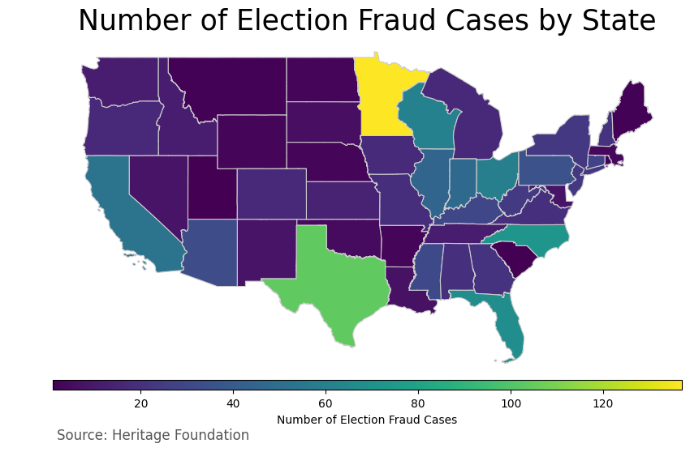

# Election Fraud

To my knowledge, The Heritage Foundation has one of the best datasets regarding voter fraud in the United States. 

## get_data.py

The following is code to scrape the data from the website, create a dataframe and save it to a csv file. 

Source: https://www.heritage.org/voterfraud

The fields extracted are:
- State
- Year
- Name
- Case Type
- Fraud Type
- Outcome
- Source

## analyze.ipynb

This notebook has a couple charts and maps for basic analysis. Feel free to customize for you own use.